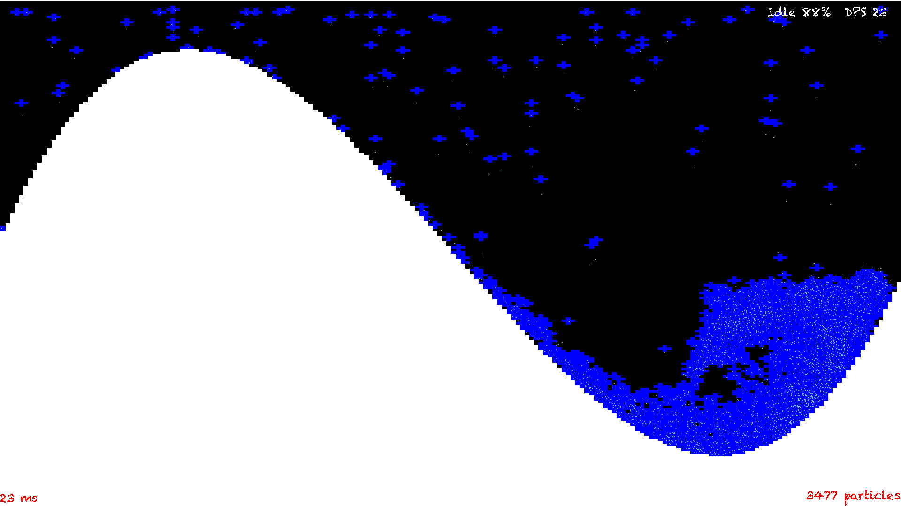
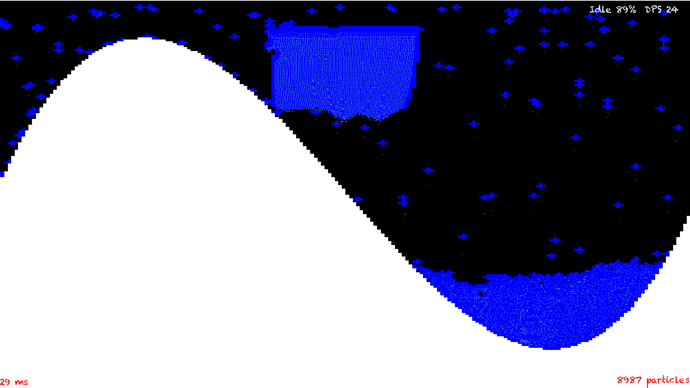

# fluid-simulation

__dependencies:__ *sdl2*, *sdl2_ttf*, *c++ toolchain*   

## SDL installation instructions   
If you are on a debian system   
`sudo apt-get install libsdl2-dev libsdl2-ttf-dev`  

Or an OSX system   
`brew install sdl2`   
`brew install sdl2_ttf`   

### ScreenShoot n1

### ScreenShoot n2

## Compilation   
`make`

## Execution   
`./mod1`
